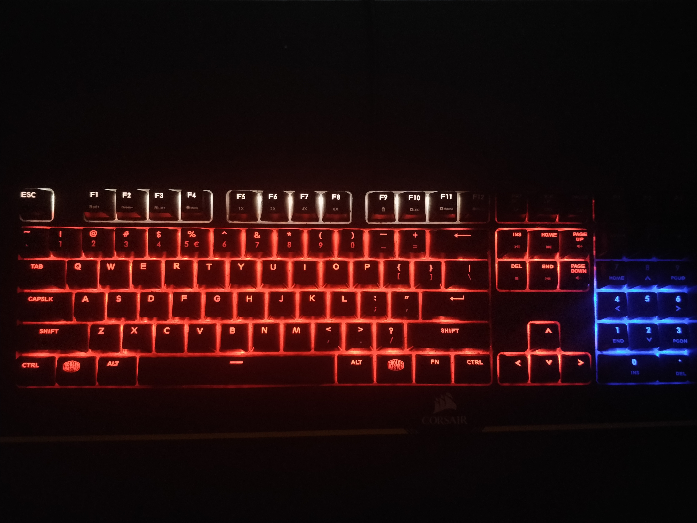

**UPDATE**

I have confirmed with GGG through email that this is allowed (for now) under the current ToS. Sadly, reading pixels is a pretty bad method of getting values out of a game. As soon as a tooltip or steam notification or anything pops up, things can get funky real fast.

For this reason I will not be developing this any further. If you meet all the requirements bellow to run this, you can download it [here](https://github.com/swordbeta/poe-rgb-keyboard/releases).

# poe-rgb-keyboard
This repository is a custom application for the game Path of Exile developed by Grinding Gear Gaming.
The application syncs the in-game health bar with an RGB keyboard without reading game data.
This is done through checking the RGB color of certain pixels on the screen where the Path of Exile orb (health bar) is located.

**Disclaimer**: I haven't programmed in C++ before and unsure if the game developers allow this. **Use at your own risk.**

## Requirements 
The requirements to run this at the moment are sadly very strict:

- You must have a Coolermaster MasterKeys Pro L RGB keyboard.
- You must play borderless with a resolution of 1920x1080 on your main monitor.
- Only works on Windows.
- Might not work properly when you have a very high energy shield. 

## Demo #1

[Higher quality GIF](https://gfycat.com/impossibleuniqueatlasmoth)

## Demo #2
Now includes experience (top row) and mana (numpad).

## Wishlist

- Support more RGB keyboards.
- Support more resolutions.
- Vertically split keyboard into health and mana.
- Read up on C++ best practices.
- Get confirmation from GGG if I'm allowed to continue.
- Test with a high energy shield.

## Building
Make sure to link the Coolermaster's SDK .lib and include the .dll found here: https://makerhub.coolermaster.com/custom-lighting/
