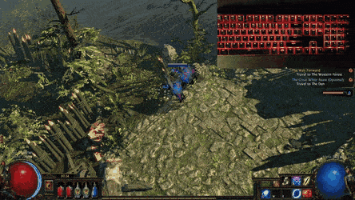

# poe-rgb-keyboard
This repository is a custom application for the game Path of Exile developed by Grinding Gear Gaming.
The application syncs the in-game health bar with an RGB keyboard without reading game data.
This is done through checking the RGB color of certain pixels on the screen where the Path of Exile orb (health bar) is located.

**Disclaimer**: I haven't programmed in C++ before and unsure if the game developers allow this. **Use at your own risk.**

## Requirements 
The requirements to run this at the moment are sadly very strict:

- You must have a Coolermaster MasterKeys Pro L RGB keyboard.
- You must play full screen or borderless with a resolution of 1920x1080 on your main monitor.
- Only works on Windows.
- Might not work properly when you have a very high energy shield. 

## Demo

[Higher quality GIF](https://gfycat.com/impossibleuniqueatlasmoth)

## Wishlist

- Support more RGB keyboards.
- Support more resolutions.
- Vertically split keyboard into health and mana.
- Read up on C++ best practices.
- Get confirmation from GGG if I'm allowed to continue.
- Test with a high energy shield.
